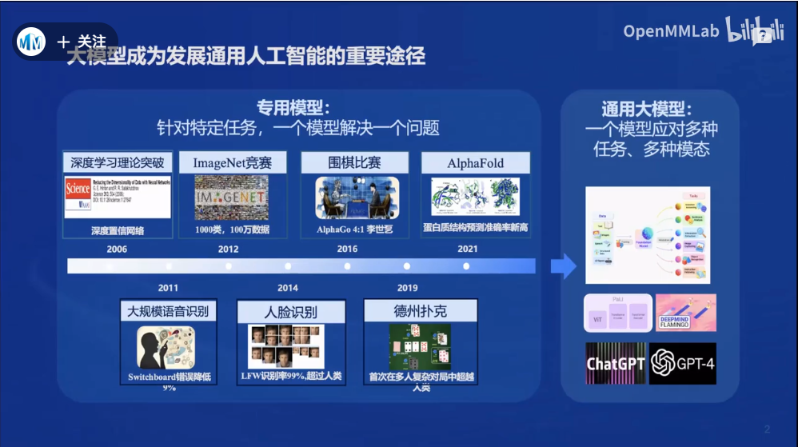
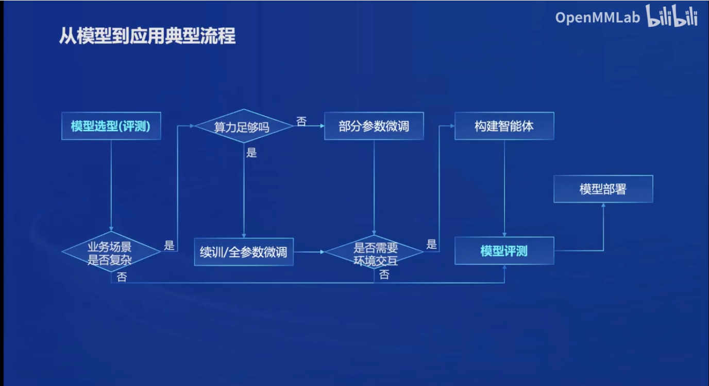
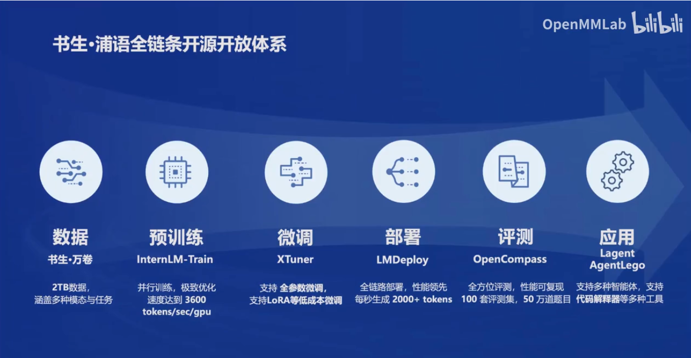
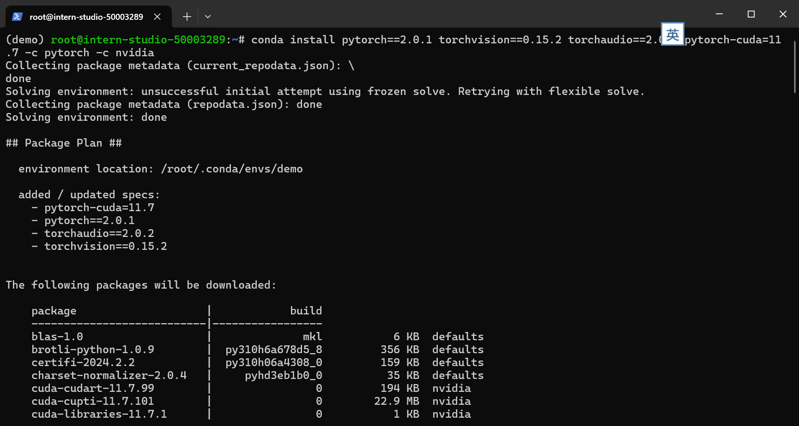
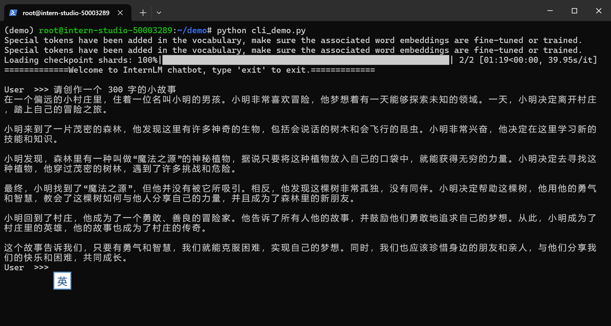

## Notes1

 

- 专用模型：针对特定任务的模型

- 通用大模型： 模型可以应对多种任务，多种模态

- 典型的数学评测数据集：Math 和GSM8K

### 从模型到应用需要进行哪些环节：



### 书生浦语全链条开发体系：



- 预训练模型：InternLM

- 微调框架： Xtuner

- 部署框架：LMDeploy

- 评测：OpenCompass

- 应用：Lagent， agentLego

## Notes2

### 部署 `InternLM2-Chat-1.8B` 模型进行智能对话

#### 创建基本环境

```shell
# 安装pytorch等其他必要的包
conda install pytorch==2.0.1 torchvision==0.15.2 torchaudio==2.0.2 pytorch-cuda=11.7 -c pytorch -c nvidia
```



#### 下载InternLM2-Chat-1.8B模型

```python
import os
from modelscope.hub.snapshot_download import snapshot_download

# 创建保存模型目录
os.system("mkdir /root/models")

# save_dir是模型保存到本地的目录
save_dir="/root/models"

snapshot_download("Shanghai_AI_Laboratory/internlm2-chat-1_8b", 
                  cache_dir=save_dir, 
                  revision='v1.1.0')

```

#### 创建书生浦语 智能会话

```python
import torch
from transformers import AutoTokenizer, AutoModelForCausalLM


model_name_or_path = "/root/models/Shanghai_AI_Laboratory/internlm2-chat-1_
8b"
# 从路径中加载预训练的模型和tokenizer
tokenizer = AutoTokenizer.from_pretrained(model_name_or_path, trust_remote_code=True, device_map='cuda:0')
model = AutoModelForCausalLM.from_pretrained(model_name_or_path, trust_remote_code=True, torch_dtype=torch.bfloat16, device_map='cuda:0')
model = model.eval()

#提示语
system_prompt = """You are an AI assistant whose name is InternLM (书生·浦语).
- InternLM (书生·浦语) is a conversational language model that is developed by Shanghai AI Laboratory (上海人工智能实验室). It is designed to be helpful, honest, and harmless.
- InternLM (书生·浦语) can understand and communicate fluently in the language chosen by the user such as English and 中文.
"""

messages = [(system_prompt, '')]

print("=============Welcome to InternLM chatbot, type 'exit' to exit.=============")

while True:
    # 用户输入框
    input_text = input("\nUser  >>> ")
    input_text = input_text.replace(' ', '')
    if input_text == "exit":
        break

    length = 0
    for response, _ in model.stream_chat(tokenizer, input_text, messages):
        if response is not None:
            print(response[length:], flush=True, end="")
            length = len(response)


```

## Homework 2

#### 效果如下


