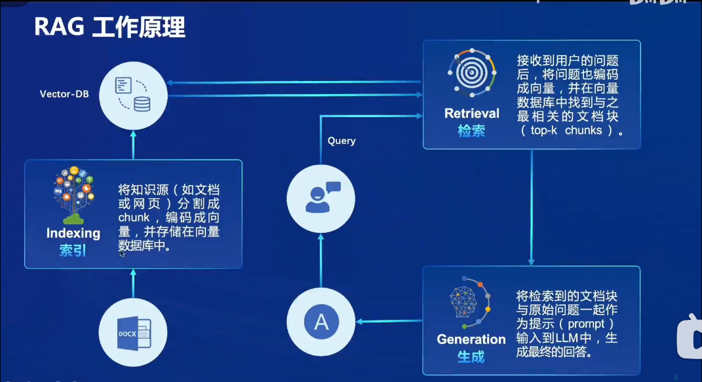
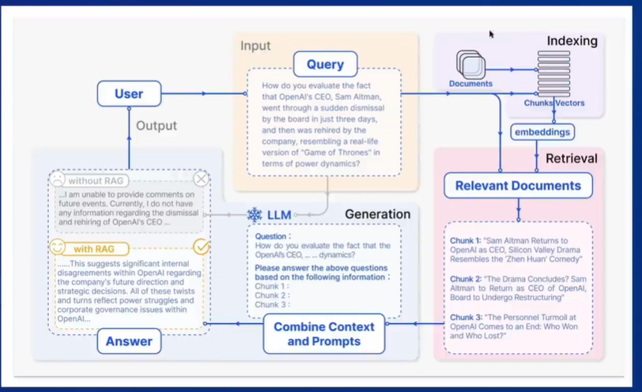
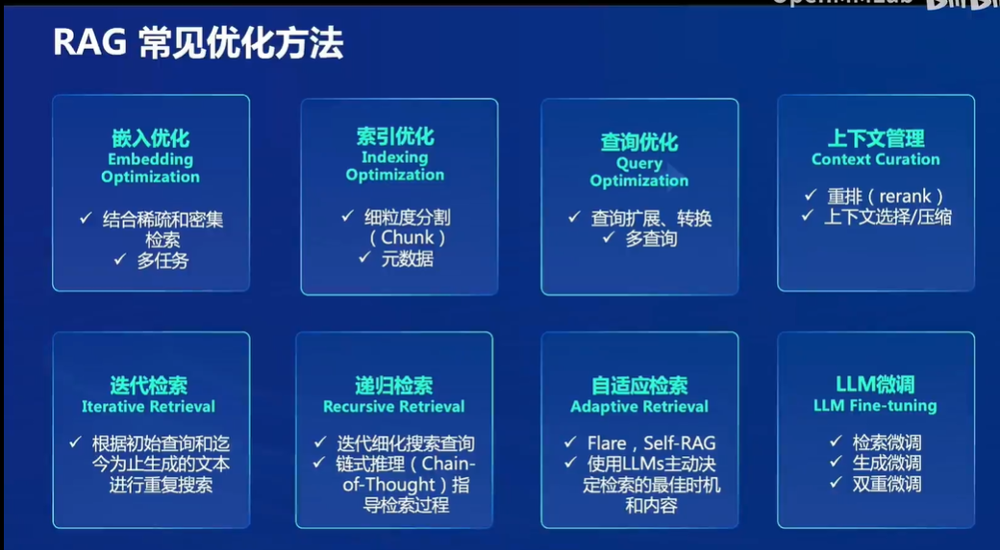
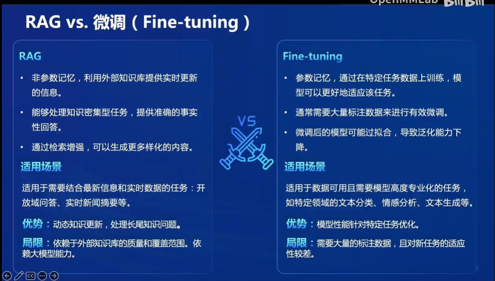
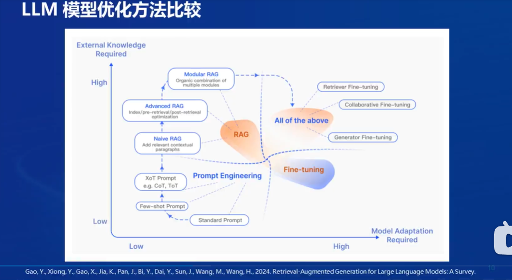
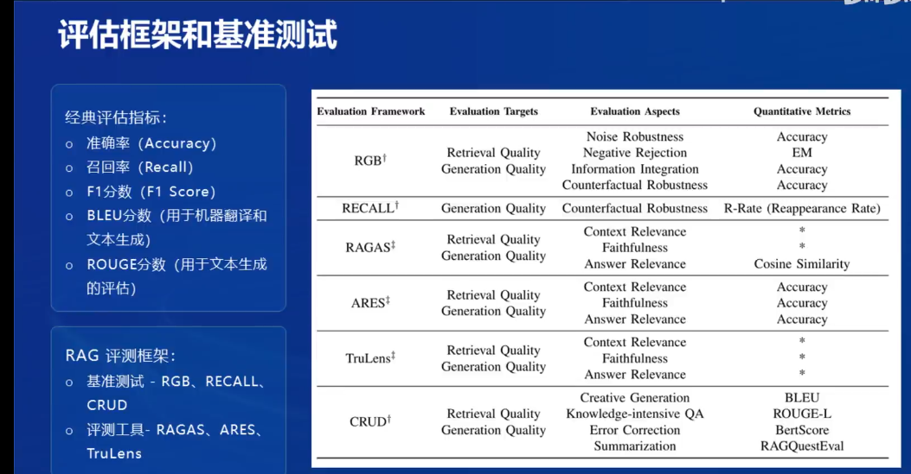
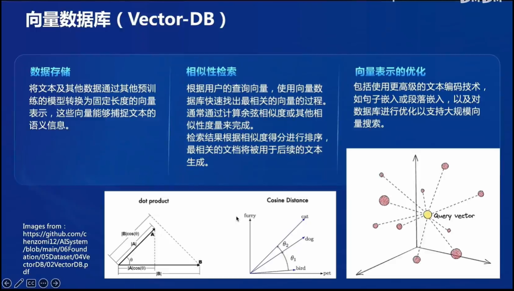

## Notes

### 什么是RAG:

> Retrieval Augmented Generation 是一种结合了检索和生成的技术，旨在利用**外部知识库**来增强大型语言模型的性能。它通过检索与用户输入相关的信息片段，并结合这些信息来生成更准确，更丰富的回答。

#### RAG的工作原理

without rag： llm可能直接回复不知道，或者乱回答。

with rag：系统会先讲用户的query转化为向量输入到向量数据库，与之前保存的向量（文档内容）计算出相似的片段（检索），返回相关的文档。之后将相关的文档和query在一同输入给大模型（生成模块），模型会将文档作为提示词来回答用户的问题。

### 发展进程

naive rag：问答系统，信息检索

advanced rag：摘要生成，内容推荐

modular rag：多模态任务，对话系统

### 常见的RAG优化方法

前两种方法是对向量数据库进行优化

第三四方法是针对查询进行优化

后面的方法则是对检索过程进行优化

最后一个方法是对大模型的优化

### RAG VS 微调

<u></u>

### LLM模型优化方法比较

从两个方面对比： 任务对外部知识的需求，另一个是任务对模型适配度的需求

- 提示工程： 适用于低外部需求和低适配度的任务

- RAG: 适用于高外部知识需求但是对模型适配性要求不高的任务

- 微调： 与RAG恰好相反

- 三种方法结合一起。

### RAG评估框架和基准测试

### 什么是向量数据库（vector-db）

通常使用点乘或者余弦距离的方法来计算相似度

## 茴香豆的工作流

## Homework

